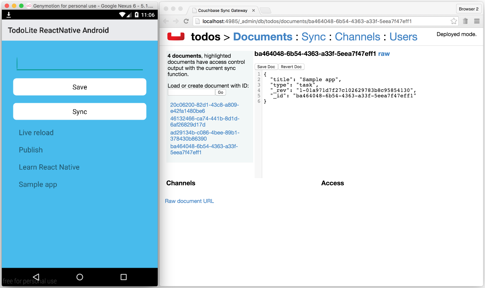

## TodoLite ReactNative Android

Basic implementation of the TodoLite sample app and step by step tutorial to learn how to build it from scratch:



### Prerequisites

- Node.js 4 or above
- Android Studio and emulator

### Getting Started

Install the Node.js dependencies:

```bash
$ npm install
```

Start the React Native daemon:

```bash
$ npm start
```

Build and install the Android application in an emulator or device:

```bash
$ ./gradlew installDebug
```

Open the app. Thanks to the React Native daemon, you can change the UI code written in JavaScript and see the changes instantly updated. On Genymotion, use the `⌘ + m` to display the settings pop-up and click on `Reload JS`.

### Adding Sync Gateway

Download Sync Gateway from the link below and unzip the file:

> http://www.couchbase.com/nosql-databases/downloads

And run Sync Gateway with this config provided in this project:

```js
~/Downloads/couchbase-sync-gateway/bin/sync_gateway /path/to/project/sync-gateway-config.json
```

To make the Sync Gateway endpoint reachable inside of the Android VM emulator, you need to enable a port from the host to the VM. In Terminal, run the following:

```bash
adb reverse tcp:4984 tcp:4984
```

Open the Admin UI to monitor the documents that were saved to Sync Gateway:

> http://localhost:4985/_admin/

Try adding more task documents and notice how they get pushed to Sync Gateway automatically.